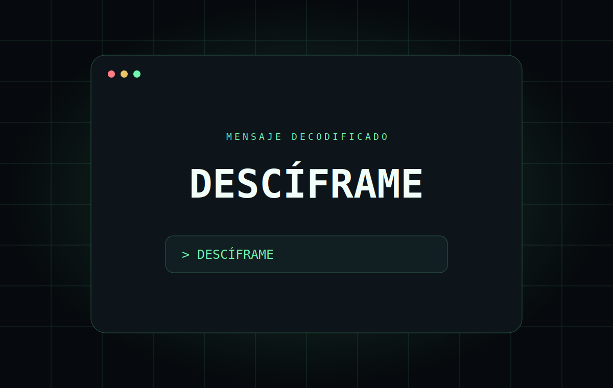

# Hacker Text Effect



Efecto de texto scramble/decoder accesible, ligero y configurable, construido con HTML, CSS y JavaScript Vanilla.

## Características

- Activación al escribir, hacer hover, clic o usar el teclado.
- Velocidad ajustable y reinicio manual.
- El cifrado comienza desde el primer carácter, sin conservar la letra inicial.
- Una sola animación `requestAnimationFrame` activa.
- Adaptación a `prefers-reduced-motion`.
- Diseño responsive desde 360 px y sin dependencias externas.
- Composición capture-first completa en una sola pantalla de escritorio.

## Demo en vivo

[hacker.ntdesweb.dev](https://hacker.ntdesweb.dev/)

## Más demos de efectos

- [Magnetic Button](https://magnetic.ntdesweb.dev/)
- [Glassmorphism Pricing Card](https://glass.ntdesweb.dev/)
- [Scroll Reveal](https://scroll.ntdesweb.dev/)

## Instalación

```bash
git clone https://github.com/NachoTorresRD/hacker-text-effect.git
cd hacker-text-effect
```

Abre `index.html` directamente en el navegador.

## Estructura

```text
hacker-text-effect/
├── assets/
├── index.html
├── style.css
├── capture.css
├── script.js
├── netlify.toml
├── robots.txt
└── sitemap.xml
```

## Personalización

Cambia los tokens de color en `:root`, edita `symbols` en `script.js` y ajusta el rango de velocidad del control HTML.

## Accesibilidad

El disparador es un botón nativo, los controles tienen etiquetas, el estado se anuncia con una región `aria-live` y el movimiento no esencial se elimina cuando el sistema lo solicita.

## Rendimiento

No usa librerías, fuentes remotas ni imágenes pesadas. La animación se cancela antes de iniciar otra y solo modifica `textContent`.

## Licencia

[MIT](LICENSE)

## Créditos

Creado por [Nacho Torres](https://github.com/NachoTorresRD) para [NTDESWEB](https://www.ntdesweb.com), usando [NT-SKILL SUPREME](https://github.com/NachoTorresRD/nt-skill-supreme).

¿Te resultó útil? [Explora el código en GitHub](https://github.com/NachoTorresRD/hacker-text-effect) o [trabaja con NTDESWEB](https://www.ntdesweb.com).
